#MVCproject
##用于学习SpringMVC，Mybatis等实例教程项目：

##一、首先先是导入项目（如果之前没有导入过项目这是个小坑）：
###1.下面演示导入项目的过程：File-->import

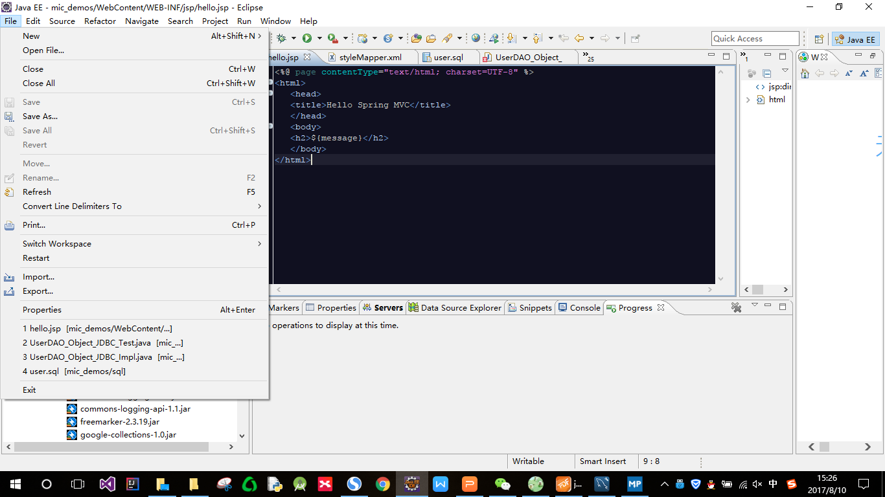

###2.选择"Exiting Projects into Workspace",然后点击“Next”。

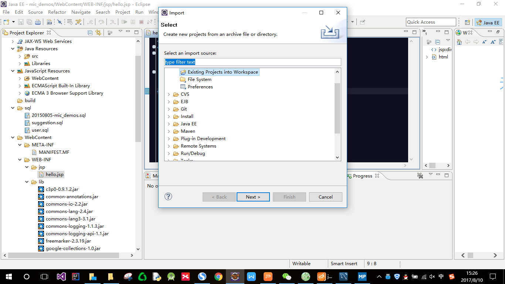

###3.点击“Browse”，找到自己项目所在的地方，然后点击“确定”。

###4.点击“Finish”。

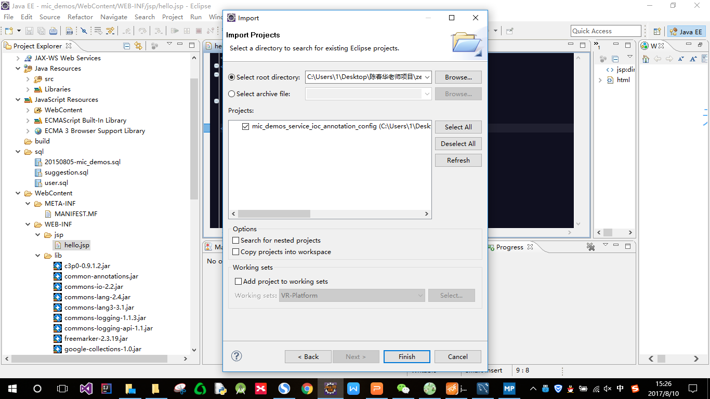

###5.然后就可以在项目导航“Project Explorer”中看到新加入的项目了。

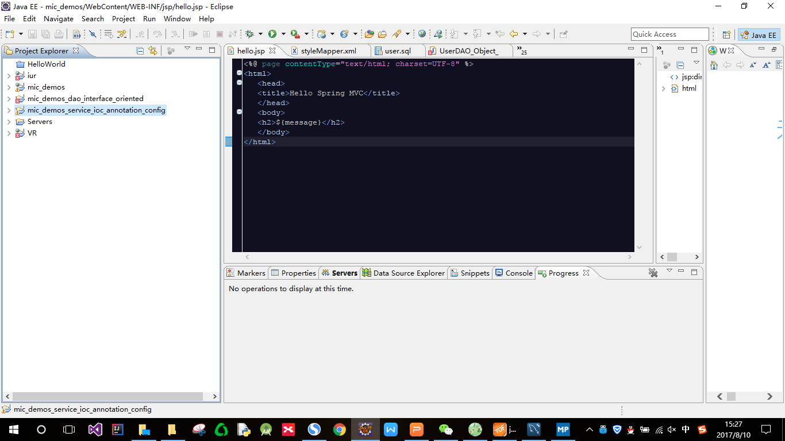

##二、修改数据库配置：

###1.打开导入项目的sql文件夹,找到sql文件

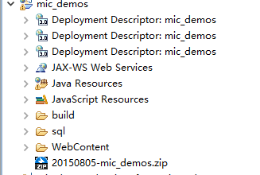
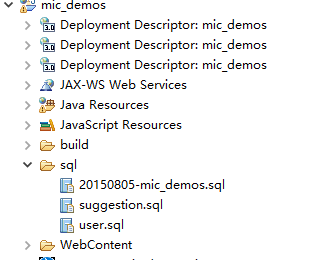

###2.打开MySQL，先记住用户名root和密码，创建数据库，名字可以自拟，但要记得在后面的相应配置中要修改。

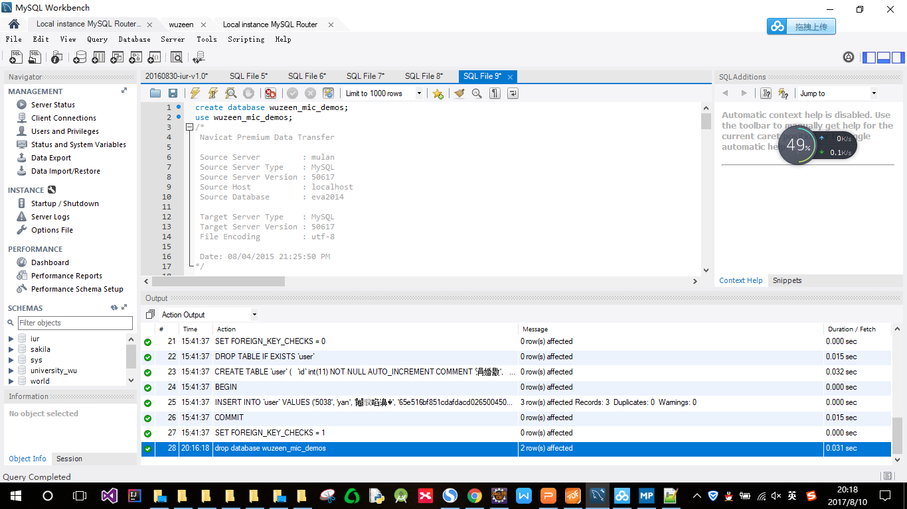

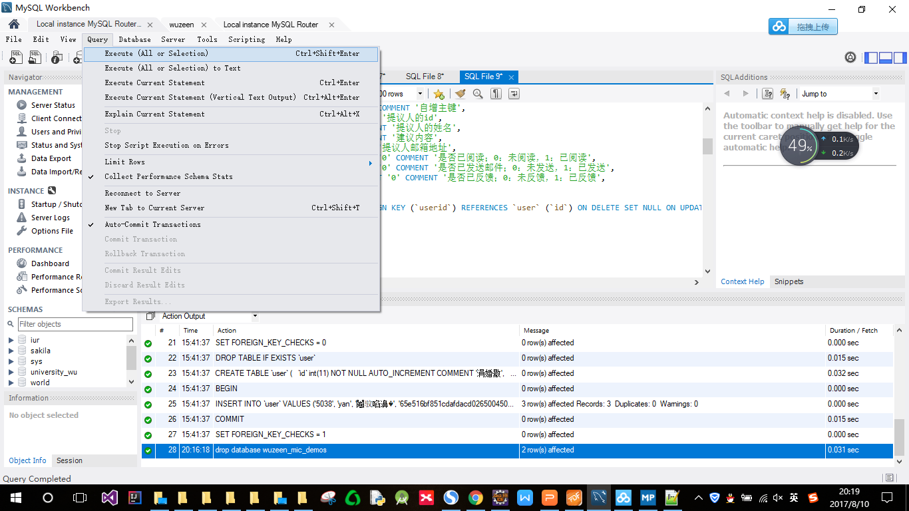

###3.将com.mic.demo.core.dao里面的JDBCSupport和SpringJDBCSupport中的用户和密码修改一下，还有uri中的数据库名称，如图，我修改了wuzeen_mic _demos,password（密码），由于用户名都是root，没改。

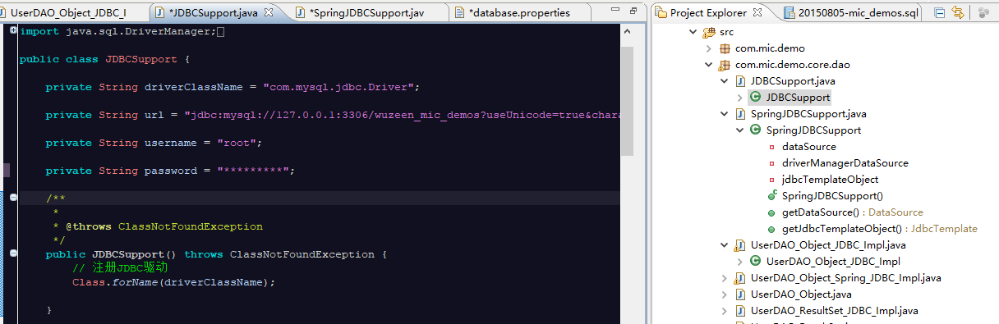

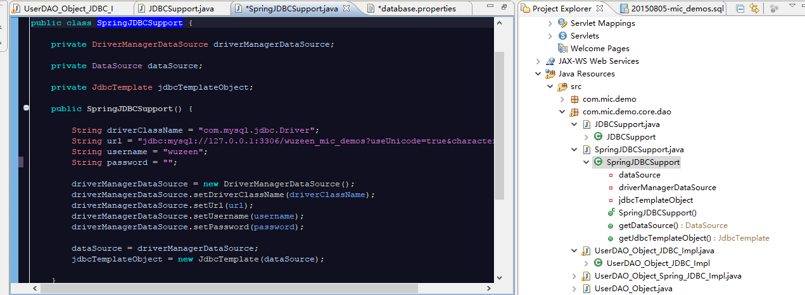

###4.开始试着跑demos，点开com.mic.demo.core.dao中的第三个UserDAO_ Object_ JDBC_ Impl，然后右键，run configurations，选用JUnit

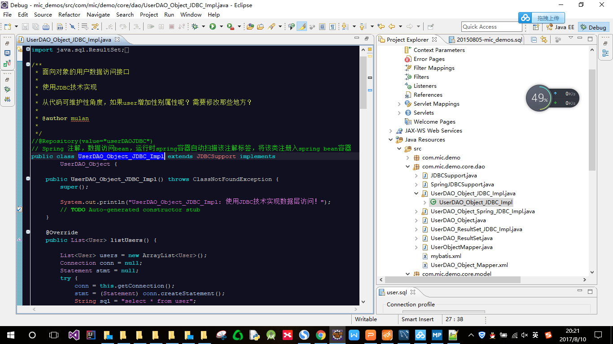
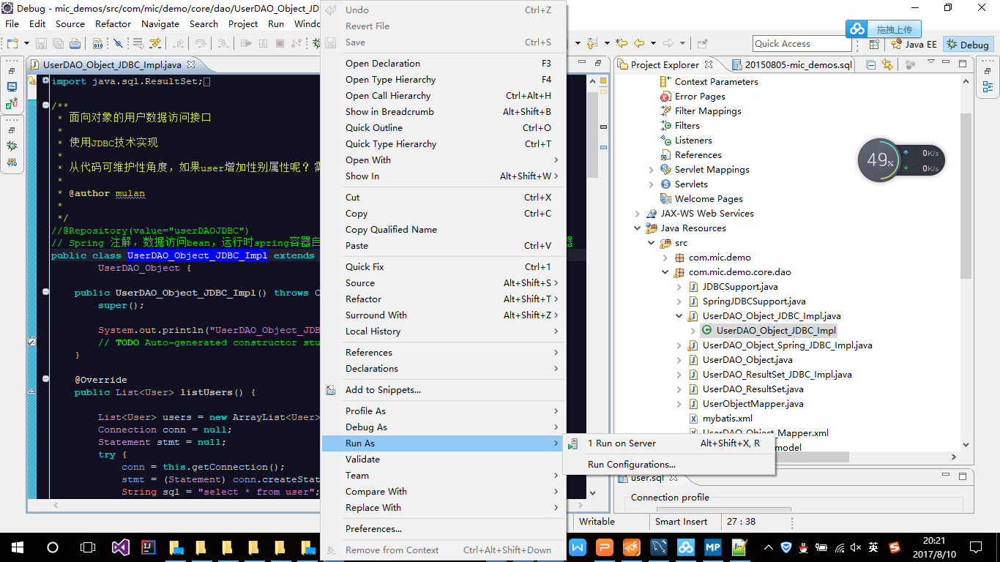
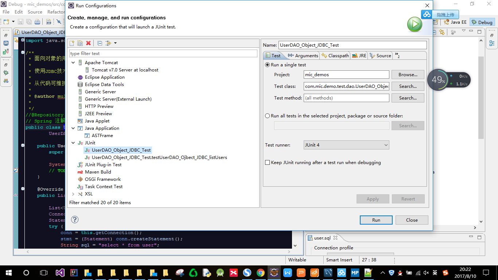

###5.跑出来的console显示：
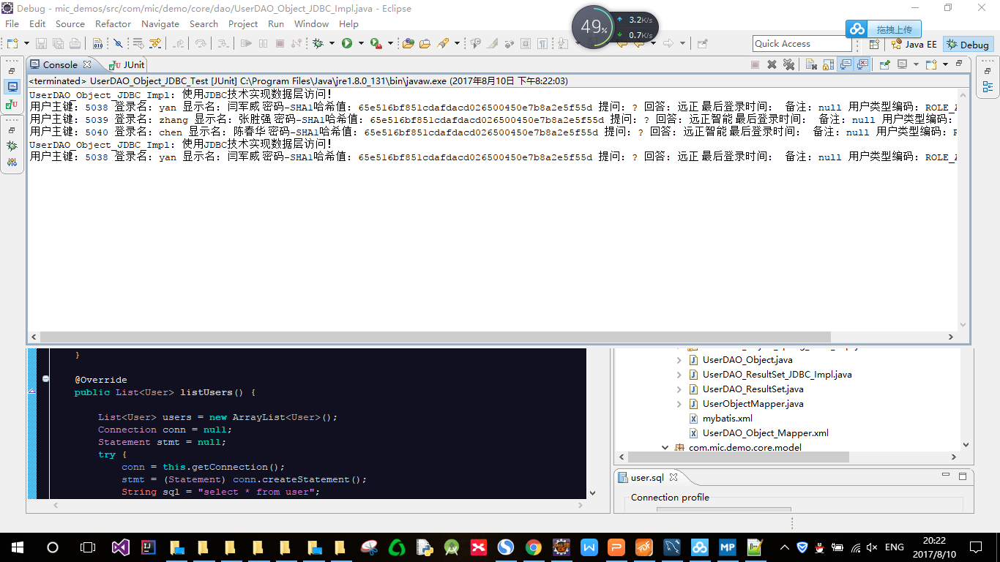

